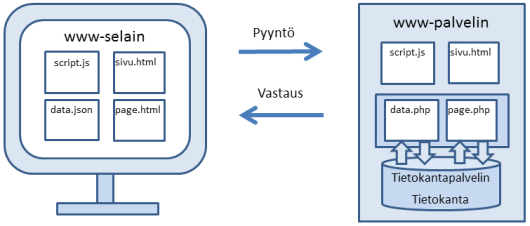
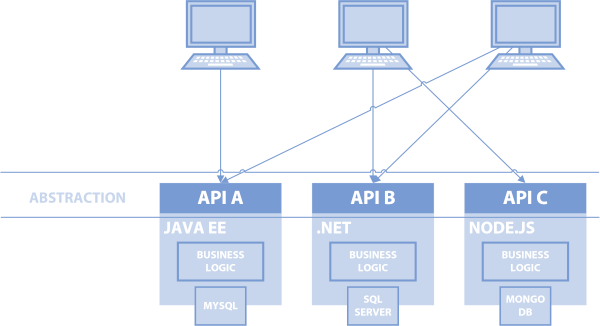
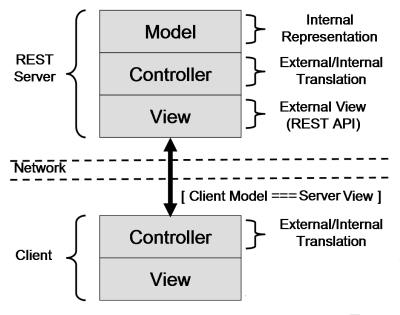
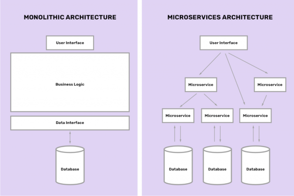
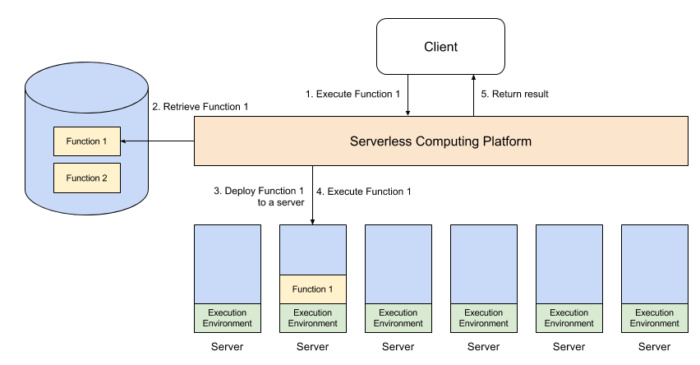
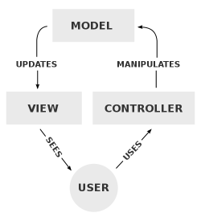
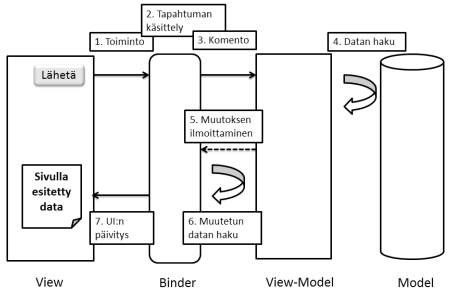
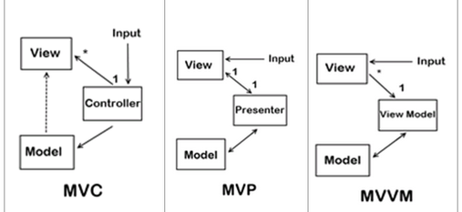

# Web-sovellusten arkkitehtuuriratkaisut

## [1 Arkkitehtuuriratkaisut ja niiden tasot](#1)

## [2 Infrastruktuuritason arkkitehtuurimallit (Infrastructure architectural patterns)](#2)

> ### [2.1 Asiakas-palvelin -arkkitehtuuri ja sen variaatiot](#21)
>
> ### [2.2 Palvelukeskeinen arkkitehtuuri eli Service Oriented Architecture (SOA)](#22)
>
> ### [2.3 REST -arkkitehtuuri](#23)
>
> ### [2.4 Microservice -arkkitehtuuri](#24)
>
> ### [2.5 Serverless -arkkitehtuuri](#25)

## [3 Ohjelmistotason arkkitehtuurimallit (Software architectural patterns)](#3)

> ### [3.1 MVC-arkkitehtuuri](#31)
>
> ### [3.2 MVVM-arkkitehtuuri](#32)
>
> ### [3.3 MVP-arkkitehtuuri](#33)
>
> ### [3.4 MVW-arkkitehtuuri](#34)
>
> ### [3.5 Web-komponettiarkkitehtuuri](#35)
>
> ### [3.6 Modulaarinen arkkitehtuuri](#36)
>
> ### [3.7 Ohjelmistotason arkkitehtuurimallien rakenneosia](#37)
>
> > ### [3.7.1 Sovelluskehykset](#371)
> >
> > ### [3.7.2 Moduulit ja ohjelmakirjastot](#372)
> >
> > ### [3.7.3 Komponentit](#373)
> >
> > ### [3.7.4 Templaattijärjestelmät](#374)
> >
> > ### [3.7.5 ORM ja ODM](#375)

## [4 Ohjelmistosuunnittelumallit (Software design patterns)](#4)

> ### [4.1 Dependency Injection ja Inversion of Control](#41)
>
> ### [4.2 Reaktiiviset suunnittelumallit ja Observer-observable pattern](#42)
>
> ### [4.3 Mediator pattern](#43)
>
> ### [4.4 Lazy-loading pattern](#44)
>
> ### [4.5 Decorator pattern](#45)

## [5 Tehtävät](#5)

## [1 Arkkitehtuuriratkaisut ja niiden tasot](#web-sovellusten-arkkitehtuuriratkaisut)

Aivan kuten rakennusarkkitehti suunnittelee mistä rakenneosista tehdään talo ja kuinka osat toimivat keskenään, sovellusarkkitehti suunnittelee web-sovelluksen rakenneosat ja niiden välisen vuorovaikutuksen. Web-sovelluksessa voidaan käyttää yhtä tai useampaa arkkitehtuuriratkaisua. Ylemmän tason arkkitehtuurin sisällä olevissa rakenneosissa voidaan käyttää toista arkkitehtuurimallia ja frontendeillä ja backendeillä voi olla omat arkkitehtuurimallinsa.  

Arkkitehtuuriratkaisujen tavoitteita ovat mm. kehitystyön helpottaminen, sovelluksen skaalautuvuuden parantaminen sekä rakenneosien uudelleenkäytettävyyden ja testattavuuden parantaminen. Jotkin arkkitehtuuriratkaisut voivat myös nopeuttaa sovelluksen toimintaa, tehostaa muistin käyttöä ja parantaa sovelluksen tietoturvaa.  

Web-sovellusten arkkitehtuuriratkaisut voidaan jakaa kolmeen tasoon. Ylemmän tason arkkitehtuurit voivat sisältää alemman tason arkkitehtuureja:

1. [Infrastruktuuritason arkkitehtuurimallit](https://aws.amazon.com/architecture/). Infrastruktuuri jakaa sovelluksen rakenneosiin. Esim. sovelluksen osien hajauttaminen eri palvelimille tai kontteihin eli palvelintason arkkitehtuuri (server architecture). Tähän sisältyy myös sovelluksen suorituksen hajauttaminen palvelin- ja asiakaspuolelle.  

2. [Ohjelmistotason arkkitehtuurimallit](https://en.wikipedia.org/wiki/Architectural_pattern). Sovellus jakautuu määriteltyihin rakenneosiin joilla on omat roolinsa. Esim. sovelluskehyksen tarjoama perusrakenne kuten MVC.  

3. [Ohjelmistosuunnittelumalli](https://en.wikipedia.org/wiki/Software_design_pattern)t. Pienempiä arkkitehtuuriratkaisuja eli malleja (pattern) jotka eivät vaikuta koko sovelluksen rakenteeseen vaan antavat esim. mallin sille miten tietty toiminto tulee toteuttaa.

Useimmat tässä esitellyt arkkitehtuuriratkaisut eivät rajoitu pelkästään web-sovelluksiin, vaan niitä käytetään kaikenlaisilla alustoilla toimivissa ohjelmistoissa. Esim. työpöytäsovellukseen alunperin kehitelty arkkitehtuuriratkaisu on voitu ottaa käyttöön web-sovellukseen kun työpöytäsovellus on nykytrendien mukaisesti muutettu web-sovellukseksi.

## [2 Infrastruktuuritason arkkitehtuurimallit (Infrastructure architectural patterns)](#web-sovellusten-arkkitehtuuriratkaisut)

### [2.1 Asiakas-palvelin -arkkitehtuuri ja sen variaatiot](#web-sovellusten-arkkitehtuuriratkaisut)

Asiakas-palvelin -malli on vanhimpia infrastruktuuritason arkkitehtuurimalleja. Web-sovellus voi noudattaa perinteistä asiakas-palvelin -arkkitehtuuria jolloin sovelluskoodi suoritetaan kokonaan palvelimella ja vain sen tuottama HTML lähetetään selaimelle. Uudempi versio tästä on ns. "thick client - thin server" -malli, jossa palvelimelta lähetetään selaimelle isompi asiakassovellus jossa tapahtuu koodin suoritus. Palvelimen tehtävänä on lähinnä välittää dataa tietokannasta asiakassovellukselle.

-[Kolme asiakas-palvelin -arkkitehtuurin variaatioita](https://mobidev.biz/blog/3_types_of_web_application_architecture)

### [2.2 Palvelukeskeinen arkkitehtuuri eli Service Oriented Architecture (SOA)](#web-sovellusten-arkkitehtuuriratkaisut)

[SOA-arkkitehtuuri](https://en.wikipedia.org/wiki/Service-oriented_architecture) on yleisnimitys arkkitehtuuriratkaisuille jotka perustuvat ulkoisista lähteistä saatavien palveluiden käyttöön sovelluksessa. Infrastruktuuri jakaa sovelluksen hajautettuihin osiin joita kutsutaan palveluiksi. Palveluita käytetään yleensä webin välityksellä API-rajapintojen kautta. API-rajapinnat abstraktoivat alla olevan sovelluslogiikan jolloin ihannetapauksessa mikä tahansa asiakassovellus voi käyttää mitä tahansa palvelua. Vanhassa SOA-arkkitehtuurissa ns. palveluväylä sijaitsi organisaation omassa verkossa. Nykyään palvelut tulevat yleensä webistä/pilvestä. SOA-arkkitehtuurin toteutuskeinoja/alamuotoja ovat esim. [SOAP](https://en.wikipedia.org/wiki/SOAP) web services, [REST](http://en.wikipedia.org/wiki/Representational_state_transfer) ja [GraphQL](https://en.wikipedia.org/wiki/GraphQL).  

### [2.3 REST-arkkitehtuuri](#web-sovellusten-arkkitehtuuriratkaisut)

[REST](http://en.wikipedia.org/wiki/Representational_state_transfer) -arkkitehtuuri voidaan määritellä yhdeksi SOA-arkkitehtuurin muodoksi. REST eli Representational State Transfer -termillä tarkoitetaan tiedonsiirtoa HTTP:n välityksellä XML-, JSON- tai tekstimuodossa. REST -rajapintoja käytetään nykyään todella paljon, paitsi sovellusten väliseen, myös sovelluksen sisäiseen tiedonsiirtoon. Sovelluksen backend eli palvelinpuoli voidaan toteuttaa esim. Nodejs:llä ja frontend eli asiakaspuoli Angularilla. Nämä ovat kokonaan erillään toisistaan ja tieto niiden välillä kulkee REST-rajapinnan kautta JSON-muodossa. Sekä backend että frontend voivat noudattaa ohjelmistotasolla esim. MVC-arkkitehtuuria.

REST-arkkitehtuurin perusidea on se, että HTTP:n peruskomennot GET, POST, PUT, PATCH ja DELETE määräävät haetaanko tietystä URL-osoitteesta dataa, lähetetäänkö sinne dataa, muokataanko siellä olevaa dataa vai poistetaanko sieltä dataa. Näin päästään manipuloimaan esim. tietokantaa asiakaspuolen sovelluksesta tehdyillä URL-pyynnöillä.

-[A Beginners guide to HTTP and REST](http://net.tutsplus.com/tutorials/other/a-beginners-introduction-to-http-and-rest/)  

  

* REST Server on palvelinpuolen sovellus. Voidaan toteuttaa esim. Nodella. Yleensä se välittää dataa tietokannasta asiakaspuolen sovellukselle.
* Tiedon välitys tapahtuu verkon yli HTTP-protokollan välityksellä yleensä asynkronisesti.  

* REST Client on asiakaspuolen sovellus joka voidaan toteuttaa web-tekniikoilla, mobiilitekniikoilla, pelimoottorilla yms.  

Palvelinpuolen ja asiakaspuolen sovellusten erottaminen toisistaan tarjoaa seuraavia hyötyjä:  

* Sovelluslogiikan hajauttaminen eri palvelimille ja asiakaspuolelle on helppoa.  

* Backend tai frontend voidaan vaihtaa, eikä toiseen osapuoleen tarvitse tehdä mitään muutoksia.  

* Voidaan helposti toteuttaa useita erilaisia asiakaspuolen sovelluksia samalle backendille.

-[REST-esimerkki](https://github.com/tuitogitti/web_arkkitehtuurit/tree/master/esimerkit/restmvc)

### [2.4 Microservice -arkkitehtuuri](#web-sovellusten-arkkitehtuuriratkaisut)

[Microservice](https://en.wikipedia.org/wiki/Microservices) -arkkitehtuuri on modulaarinen palvelintason arkkitehtuuri joka voi toimia myös SOA-arkkitehtuurin periaatteella. Backend koostuu toisistaan riippumattomista mikropalveluista jotka voivat siirtää dataa sovelluksen "päämoduulille" tai suoraan asiakassovellukselle web-selaimeen tai mobiililaitteelle. Jokaisella mikropalvelulla on oma tietovarasto, yleensä tietokanta. Microservice -sovelluksen vastakohta on monoliittinen sovellus, jossa kaikki palvelut ovat kiinni samassa backend-sovelluksessa ilman mahdollisuutta erottaa niitä toisistaan.  

Microservice-arkkitehtuurin suurimpana etuna on mahdollisuus päivittää sovellusta nopeasti uudella mikropalvelulla ja mahdollisuus päivittää väin tietty mikropalvelu ilman että tarvitsee tehdä muutoksia koko sovelluksen koodiin. Mikropalvelut pakataan usein [Docker](https://www.docker.com/what-docker)-kontteihin jotka ovat helposti siirreltäviä. Mikropalveluita voidaan toteuttaa kaikilla yleisimmillä web-sovellusten kehitykseen käytetyillä kielillä ja niiden kehittämiseen on omia sovelluskehyksiään, esim. Nodejs:n [Seneca](http://senecajs.org/) ja PHP:n [Lumen](https://lumen.laravel.com/).  

  

-[Build a NodeJS cinema microservice and deploying it with Docker](https://medium.com/@cramirez92/build-a-nodejs-cinema-microservice-and-deploying-it-with-docker-part-1-7e28e25bfa8b)

### [2.5 Serverless-arkkitehtuuri](#web-sovellusten-arkkitehtuuriratkaisut)

[Serverless](https://en.wikipedia.org/wiki/Serverless_computing) -arkkitehtuurissa backend toteutetaan joko kokonaan tai osittain pilvipalvelualustan tarjoamina palveluina. Monet kehittäjät käyttävät nykyään valmiita pilvipalveluiden tarjoamia backend-moduuleja ja keskittyvät kehitystyössä lähinnä frontendiin. Serverless -ratkaisussa serveri on tietysti olemassa, mutta kehittäjän ei tarvitse kiinnittää siihen lainkaan huomiota. Serverless-ratkaisu voi olla [Backend as a Service](https://en.wikipedia.org/wiki/Mobile_backend_as_a_service) (BaaS) tai [Function as a Service](https://en.wikipedia.org/wiki/Function_as_a_service) (Faas) tai niiden yhdistelmä.  

Baas -palvelu on hieman suurempi serverless-palvelu kuten tietovarasto tai autentikaatiopalvelu. Tyypillinen esimerkki on [Googlen Firebase](https://firebase.google.com/)  joka tarjoaa palveluja mobiilisovelluksille.  

Faas-palvelut ovat mikropalveluita jotka muodostuvat funktioista. Vanhin ja tunnetuin FaaS-alusta on [AWS Lambda](https://aws.amazon.com/lambda/details/). Serverless-funktiot soveltuvat hyvin tilanteisiin joissa jokin  tapahtuma sovelluksessa laukaisee funktion suorituksen. Esimerkiksi videon laittaminen Amazonin S3 Bucket -tietovarastoon on tapahtuma joka laukaisee lambda-funktion joka tekee videosta kompressoidun version ja tallentaa sen eri paikkaan kuin alkuperäisen. Tapahtumapohjaisen mikropalvelun suorittaminen serverless-periaatteella ilman oman palvelimen ylläpitoa on edullista. Serverless-mikropalvelu on käynnissä vain sen ajan kun sitä käytetään eli edellisessä esimerkissä niin kauan kuin kompressointi ja tallennus kesti.

Serverless-funktioilla toteutetaan tyypillisesti vain ne backendin toiminnot, esim. tapahtumilla laukaistavat toiminnot, joihin funktiot soveltuvat hyvin. Sovelluksella voi olla edelleen myös perinteinen backend jossa suoritetaan muita toimintoja. Kokonaisen laajan backendin totetuttaminen serverless-periaatteella voi tehdä arkkitehtuurista monimutkaisen, sekavan ja vaikeasti testattavan.

-[Serverless Architecture: Five Design Patterns](https://thenewstack.io/serverless-architecture-five-design-patterns/)  
-[Serverless Architecture Criticism and Drawbacks](https://medium.com/@MarutiTech/what-is-serverless-architecture-what-are-its-criticisms-and-drawbacks-928659f9899a)  

Kuvassa on esitetty Serverless -funktioiden käytön perusperiaate:  

1. Asiakas pyytää että Serverless-ajoympäristö  suorittaisi  funktion  (joka  on  joko  valmisfunktio  tai  asiakkaan  itse  luoma funktio)
2. Ajoympäristö tutkii onko funktio jo toiminnassa jollain serverillä vai pitääkö se hakea varastosta. Funktio on containerissa (esim. Docker) oleva mikropalvelu.  

3. Jos funktio pitää hakea varastosta, se asennetaan serverille.
4. Ajoympäristö suorittaa funktion ja ottaa talteen suorituksen tuloksen.
5. Tulos palautetaan asiakkaalle.  

Funktio ja sen container poistetaan serveriltä suorituksen jälkeen. Vain funktion suoritusajasta serverillä (jokainen 100ms) laskutetaan asiakasta.  

-[Serverless deployment](http://microservices.io/patterns/deployment/serverless-deployment.html)

## [3 Ohjelmistotason arkkitehtuurimallit (Software architectural patterns)](#web-sovellusten-arkkitehtuuriratkaisut)

### [3.1 MVC-arkkitehtuuri](#web-sovellusten-arkkitehtuuriratkaisut)

[MVC](http://en.wikipedia.org/wiki/Model%E2%80%93view%E2%80%93controller) eli Model-View-Controller on web-sovellusten yleisin ohjelmistotason arkkitehtuurimalli. Sitä käytetään sekä backend- että frontend-sovelluksissa, esim. Expressissä (Nodejs), osittain Angularissa. Useimmissa PHP-, .NET ja JavaEE -sovelluskehyksissä on käytössä MVC -malli.  

  

* Malli (**M**odel) sisältää sovelluksen datan.  

* Näkymä (**V**iew), käyttöliittymä,  on datan visuaalinen esitys jonka käyttäjä näkee.
* Ohjain (**C**ontroller), ohjaa sovelluksen toimintaa. Kontrolleri on yleensä luokka joka sisältää metodeja jotka vastaavat sovelluksen toimintoja. Käyttäjä käyttää kontrollerin metodeja.  Metodit  muokkaavat mallia, ja mallin muutokset välittyvät näkymään.

Eri kerrokset on erotettu toisistaan kooditasolla ja käyttöliittymäkehittäjä voi kehittää esim. pelkästään viewiä, ilman että tarvitsee juurikaan koskea kontrollerin tai modelin koodiin.  

Palvelinpuolen MVC-sovelluksen view on ollut perinteisesti ns. backendin view, eli tarkoittaa sitä että view luodaan templaattiin, eli yleensä HTML-sivupohjaan, palvelinpuolelle. Tällöin view on sidottu palvelinpuolen koodiin, eikä voida sanoa että sovelluksella olisi erillinen frontend. Usein  MVC-arkkitehtuuria noudattavassa web-sovelluksessa on myös REST-api joka mahdollistaa tiedon vaihtamisen samaan sovellukseen kuuluvan erillisen frontendin tai muiden sovellusten kanssa. MVC + REST on web-sovellusten yleisimpiä arkkitehtuuriyhdistelmiä.

-[MCV-esimerkki](https://github.com/tuitogitti/web_arkkitehtuurit/tree/master/esimerkit/restmvc)

### [3.2 MVVM-arkkitehtuuri](#web-sovellusten-arkkitehtuuriratkaisut)

[MVVM](http://en.wikipedia.org/wiki/Model_View_ViewModel) (Model-View-ViewModel) on MVC arkkitehtuurin muunnos, jossa controllerin tilalla on view-model. Se on kerros jonka tehtävänä on ottaa vastaan dataa modelista. Data välitetään siitä varsinaiseen viewiin. Välissä on usein ns. Binder-kerros joka sitoo toisiinsa viewin ja view-modelin. Binder toteuttaa two-way data bindingin, eli muutos modeliin näkyy heti viewissä ja toisinpäin. MVVM on käytössä useissa JS frontend-sovelluskehyksissä kuten [Vuessa](https://012.vuejs.org/guide/), Emberissä ja Knockoutissa. Myös Angular noudattaa osittain MVVM -mallia.  

### [3.3 MVP-arkkitehtuuri](#web-sovellusten-arkkitehtuuriratkaisut)

[MVP](https://en.wikipedia.org/wiki/Model%E2%80%93view%E2%80%93presenter) (Model-View-Presenter) on MVC-arkkitehtuurin muunnos jossa controllerin tilalla on presenter. MVP toimii muuten kuten MVVM, mutta MVP:ssä ei ole binder-kerrosta. Presenter-kerros hoitaa käyttöliittymälogiikan ja toimittaa esitettävän datan viewille. MVP-mallissa yhtä presenteriä vastaa aina yksi view. MVP on web-sovelluksissa käytössä enimmäkseen käyttöliittymäsovelluskehyksissä, kuten Vaadin ja GWT (JavaEE).  

### [3.4 MVW-arkkitehtuuri](#web-sovellusten-arkkitehtuuriratkaisut)

[MVW](http://www.quora.com/What-is-MVW-Model-View-Whatever-How-is-it-different-from-MVC) (Model-View-Whatever) tarkoittaa arkkitehtuuria jossa on selvästi erotettavissa model ja view, mutta kontrolleri ei välttämättä toimi perinteisen kontrollerin tavoin. Arkkitehtuuri voi esimerkiksi olla tilanteen mukaan MVC, MVP tai MVVM. Angularin arkkitehtuuri on tästä tyypillinen esimerkki. Myös laajemmissa React-sovelluksissa paljon käytetty [Flux](https://blog.mgechev.com/2015/05/15/flux-in-depth-overview-components/)-arkkitehtuuri edustaa lähinnä MVW -arkkitehtuuria.

-[MVW -esimerkki](https://github.com/tuitogitti/web_arkkitehtuurit/tree/master/esimerkit/ang-contactapp2)

### [3.5 Web-komponenttiarkkitehtuuri](#web-sovellusten-arkkitehtuuriratkaisut)

Web-komponenttiarkkitehtuuri tarkoittaa tässä [Web-components](https://en.wikipedia.org/wiki/Web_Components) -periaatteen mukaista käyttöliittymä- arkkitehtuuria jossa web-sovelluksen käyttöliittymä pilkotaan erillisiin uudelleenkäytettäviin komponentteihin jotka ovat vuorovaikutuksessa toistensa kanssa. Tunnetuimpia toteutuksia ovat [React](https://facebook.github.io/react/), [Angular](https://angular.io/) ja [Vue](https://vuejs.org/). [Komponenttiarkkitehtuurilla](https://en.wikipedia.org/wiki/Component-based_software_engineering) voi olla myös muita merkityksiä.

### [3.6 Modulaarinen arkkitehtuuri](#web-sovellusten-arkkitehtuuriratkaisut)

[Modulaarisen](https://en.wikipedia.org/wiki/Modular_programming) arkkitehtuurin perusperiaatteena on se että sovellus muodostuu itsenäisistä moduuleista joita voidaan poistaa, lisätä tai korvata toisilla moduuleilla. Käsitteet komponentti ja moduuli voidaan sekoittaa toisiinsa, mutta yleensä moduuli on suurempi kokonaisuus kuin komponentti. Angular-sovelluksen komponentit pakataan moduuleihin. Esim. verkkokaupassa voi olla käyttöliittymämoduuli joka sisältää käyttöliittymäkomponentit ja maksumoduuli joka sisältää maksamiseen liittyvät komponentit. Monet nykyaikaiset web-sovellukset ovat ainakin osittain modulaarisia, sillä ne käyttävät Nodejs:n npm-moduuleja. Myös Wordpressin rakenne on modulaarinen, sillä WP-järjestelmään on mahdollisuus asentaa lisäosia joita voidaan kutsua moduuleiksi. Palvelinpuolen Microservices -arkkitehtuuri on myös modulaarinen arkkitehtuuri.

### [3.7 Ohjelmistotason arkkitehtuurimallien rakenneosia](#web-sovellusten-arkkitehtuuriratkaisut)

### [3.7.1 Sovelluskehykset](#web-sovellusten-arkkitehtuuriratkaisut)

[Web-sovelluskehys](https://en.wikipedia.org/wiki/Web_application_framework) (web application framework) on koodirunko jonka varaan web-sovellus voidaan rakentaa. Se sisältää kansiorakenteen ja luokkakirjastoja joiden avulla voidaan toteuttaa sovelluksen perusrakenne ja -toiminnot. Nykyaikaisiin sovelluskehyksiin on helppo lisätä uusia kirjastoja tarpeen mukaan ja niiden päivitys on yleensä myös automatisoitu. Sovelluskehys voi käyttää yhtä tai useampaa edellä kuvatuista arkkitehtuurimalleista.

Web-sovelluskehyksissä käytetään yleisimmin MVC-arkkitehtuuria jonka avulla sovelluslogiikka erotetaan käyttöliittymästä. Tällöin model-, view- ja controller -koodit sijoitetaan omiin kansioihinsa. Sovelluksen mediaelementeille yms. rakenneosille on omat kansionsa.

Web-sovellusten kehittämiseen on olemassa valtavasti [erilaisia sovelluskehyksiä](https://en.wikipedia.org/wiki/Comparison_of_web_application_frameworks). Lähes kaikilla web-sovelluskehitykseen sopivilla ohjelmointikielillä on kymmeniä tai jopa satoja vaihtoehtoja sovelluskehyksen valintaan.

Tunnettuja JavaEE -sovelluskehyksiä ovat mm. [Spring](https://spring.io/) ja [JSF](http://www.javaserverfaces.org/). Tunnettuja PHP-sovelluskehyksiä ovat mm. [CodeIgniter](http://codeigniter.com/), [Laravel](http://laravel.com/) ja [Symfony](https://symfony.com/). Microsoftin palvelimille toteutettavassa webkehityksessä käytetään paljon [ASP.NET MVC](https://www.asp.net/mvc) -sovelluskehystä. Yleisin Nodejs-sovelluskehys on [Express](http://expressjs.com/).

Frontendeille, joiden toiminnallisuus web-sovelluksissa toteutetaan Javascriptillä, on myös paljon sovelluskehyksiä. Esim. [Angular](https://angular.io/), [Backbone](http://backbonejs.org/), [Ember](http://emberjs.com/), [Vue](https://vuejs.org/), [React](https://reactjs.org) jne. Reactia ja Vueta ei määritellä yleensä täydellisiksi sovelluskehyksiksi vaan käyttöliittymäkirjastoiksi joilla toteutetaan ensisijaisesti vain sovelluksen view. Lisäkirjastojen avulla molempien toiminnallisuutta voidaan laajentaa täydellisiksi sovelluskehyksiksi.  

**Sovelluskehyksen etuja**: Pakottaa käyttämään järkevää arkkitehtuurimallia. Sovelluksen rakenneosat erottuvat selkeästi, siitä tulee helpommin muokattava ja päivitettävä. Sovelluskehitys nopeutuu kun sovelluskehystä, sen kirjastoja ja komponentteja opitaan käyttämään. Sovelluskehykset sisältävät paljon valmiita palveluja joita ei tarvitse koodata itse alusta alkaen. Sovelluskehys yleensä parantaa sovelluksen tietoturvaominaisuuksia jotka on yleisimmissä sovelluskehyksissä otettu hyvin huomioon.

**Sovelluskehyksen haittoja**: Uuden koodaustavan opettelu, riippuvuus sovelluskehyksestä - jos koodi siirretään, pitää siirtää sovelluskehys mukana. Suuret sovelluskehykset voivat sisältää turhaa koodia. Rakenne usein monimutkaistuu. Uudemmat sovelluskehykset ovat tosin ytimeltään suppeita ja niihin asennetaan lisäpalveluja vain tarvittaessa, joten turhaa koodia ei juurikaan ole mukana.

### [3.7.2 Moduulit ja ohjelmakirjastot](#web-sovellusten-arkkitehtuuriratkaisut)

Moduulin käsiteellä on sovelluskehityksessä monia merkityksiä; vrt. [moduulaarinen arkkitehtuuri](#36). Esim. JS-sovelluskehityksessä moduuli ja ohjelmakirjasto voivat tarkoittaa samaa asiaa, koska ohjelmakirjastoja ladataan sovelluksiin npm-moduuleina. [Npm](https://www.npmjs.com/) eli Node package manager lataa JS-kirjastot ja niiden riippuvuudet automaattisesti  komentorivityökalun avulla.  Monet sovelluskehyksetkin ovat ladattavissa npm-moduuleina.

Javascriptille on kehitetty moduulijärjestelmiä joiden avulla kehittäjä voi liittää sovellukseensa moduuleja ja tehdä myös omasta JS-koodistaan modulaarista eli "exportata" oman koodinsa rakenneosia moduuleina. [CommonJS](https://webpack.github.io/docs/commonjs.html) on perinteinen JS:n moduulijärjestelmä. Nodejs ja npm käyttävät sitä. Uudemmissa ES6-sovelluksissa on kuitenkin yleisesti käytössä [ES6 Modules](http://exploringjs.com/es6/ch_modules.html), joka on JS:n ES6-version moduulijärjestelmä. Se on käytössä mm. Angularissa.

Hieman samantapaisia ratkaisuja on muissakin ohjelmointikielissä. Esim. PHP:n [Composer](https://getcomposer.org/) -paketit ja JavaEE:n [Maven](https://maven.apache.org/) -paketit.

### [3.7.3 Komponentit](#web-sovellusten-arkkitehtuuriratkaisut)

[Komponentti](https://simplicable.com/new/software-components) on yleensä pienempi ohjelmiston osa kuin moduuli. Esim. Angularissa komponentit pakataan moduulin sisään. Komponentin käsite voi viitata frontend tai backend -komponenttiin. Esim. Angularin tai Reactin käyttöliittymäkomponentit ovat melko pieniä JS/TS-luokkia tai -funktioita. Käyttöliittymäkomponetti suorittaa monesti vain yhtä pientä tehtävää, esim. näyttää navigaatiopalkin tai sen osan ja toteuttaa sen käyttöliittymäpuolen toiminnallisuuden.

### [3.7.4 Templaattijärjestelmät](#web-sovellusten-arkkitehtuuriratkaisut)

Templaatti (template) on UI-sivupohja johon upotetaan dataa. Templaatin tarkoituksena on että sivun esityslogiikka (ulkoasu) erotetaan toimintalogiikasta (koodi). Sovelluskehityksessä pyritään usein siihen että ohjelmakoodi erotetaan mahdollisimman hyvin HTML-koodista ja suunnittelija joka ei hallitse ohjelmointia voi suunnitella sivuston HTML-rakenteen ja ulkoasun tarvitsematta koskea lainkaan ohjelmakoodiin. Nodejs:n Express -sovelluskehyksessä (Nodejs) voi käyttää useampaakin eri [templaattijärjestelmää](https://colorlib.com/wp/top-templating-engines-for-javascript/) (Template-engine). Templaattijärjestelmä voi olla erillinen järjestelmä  tai se voi sisältyä  sovelluskehykseen. Templaattisivun renderöinti voi tapahtua palvelinpuolella (esim. EJS(Node), Smarty(PHP)) tai asiakaspuolella (esim. Angularin templaatti).  

Komponenttipohjaisten UI-kirjastojen - kuten Angular, React tai Vue - yleistyessä, tulee erillisten templaattijärjestelmien merkitys todennäköisesti vähenemään. Reactissa templaatti on upotettu komponenttiin muun koodin sekaan ja sitä ei yleensä irroiteta sieltä. Angularissa templaatti on yleensä erotettu komponentista erilliseksi tiedostoksi johon viitataan komponentissa.

-[Web template system](https://en.wikipedia.org/wiki/Web_template_system) (Wikipedia)

### [3.7.5 ORM ja ODM](#web-sovellusten-arkkitehtuuriratkaisut)

Usein sovelluksissa tarvitaan sellaista ominaisuutta että oliot voidaan tallentaa pysyvään tilaan. Oliot häviävät koneen muistista lopetettaessa sovellus. Jos halutaan vaikkapa jatkaa myöhemmin tilanteesta johon lopetettaessa jäätiin, olisi hyvä saada olioiden tila tallennettua ja pystyä palauttamaan ne tallennustilasta muistiin. Hyvä esimerkki tästä on vaikkapa roolipelin tilanteen tallennus ja jatkaminen siitä (save/resume). Object Persistence eli olioiden pysyvyys on termi jota usein käytetään kuvaamaan tätä prosessia.  

Erilaisia tapoja tallentaa oliot: 1) [Serialisointi](https://en.wikipedia.org/wiki/Serialization) eli olioiden tilan tallentaminen tiedostoon joka puolestaan voidaan tallentaa kansioon, sessioon tai tietokantaan, 2) [Object Relational Mapping (ORM)](http://en.wikipedia.org/wiki/Object-relational_mapping), olioiden tilan tallentaminen relaatiotietokantaan. 3) [Object Document Mapping (ODM)](http://stackoverflow.com/questions/12261866/what-is-the-difference-between-an-orm-and-an-odm), olioiden tilan tallentaminen NoSQL-dokumenttiin.  

Nykyaikaisissa sovelluksissa käytetään lähinnä ORM/ODM-ratkaisuja. ORM/ODM-työkalut ovat joko erillisiä kirjastoja tai tulevat sovelluskehyksen mukana. ORM/ODM -ratkaisut tallentavat myös olioiden väliset riippuvuudet. Jos yhden olion ominaisuudet ovat vaikkapa yhdessä relaatiotietokannan taulun tietueessa, niin toinenkin tietue toisessa taulussa voi muuttua samanaikaisesti kun oliota päivitetään. Näin tapahtuu jos olioiden välillä on riippuvuus, jota kannassa kuvataan relaatiolla.

ORM/ODM -kirjastot ovat aina backend-puolen kirjastoja. Tunnettuja ORM -kirjastoja ovat mm. JavaEE:n [Hibernate](http://hibernate.org/) ja .NET:in [Entity framework](https://docs.microsoft.com/en-us/ef/ef6/index). Nodejs-sovelluskehityksessä käytetään usein NoSQL-kantoja joiden kanssa käytetään ODM-kirjastoja. MongoDB:n kanssa toimiva [Mongoose](http://mongoosejs.com/) on Noden yleisin ODM-kirjasto. PHP:lle on tehty useita ORM -kirjastoja, esim. [Doctrine](http://www.doctrine-project.org/). ORM-kirjasto voidaan ottaa käyttöön sovelluskehyksen lisäkirjastona tai sovelluskehykset voivat sisältää sisäänrakennettuja ORM -kirjastoja kuten Laravelin (PHP) [Eloquent ORM](https://laravel.com/docs/5.0/eloquent).

ORM- ja ODM-kirjastot eivät pelkästään hallinnoi olioiden tallentamista kantaan ja sieltä palauttamista, vaan ne yleensä myös abstraktoivat tietokantarajapinnan eli tarjoavat yksinkertaisemmat metodit tietokannan käsittelyyn. ORM/ODM:n tarjoaman rajapinnan abstraktion ansiosta tietokannan vaihtaminen helpottuu huomattavasti. ORM/ODM:n käyttö myös pakottaa kantaan tallennettavan tiedon tietyn mallin mukaiseksi jolloin mitä tahansa tietoa ei voi tallentaa kantaan eli tiedon luotettavuus paranee. Joskus tietokantaa voi käyttää sovelluskehyksessä ainoastaan ORM/ODM -rajapinnan kautta.

-[ODM -esimerkki](https://github.com/tuitogitti/web_arkkitehtuurit/tree/master/esimerkit/restmvc)

## [4 Ohjelmistosuunnittelumallit (Software design patterns)](#web-sovellusten-arkkitehtuuriratkaisut)

[Ohjelmistosuunnittelumalleja](https://en.wikipedia.org/wiki/Software_design_pattern) on kehitetty ennen kuin web-sovelluksia oli edes olemassa. Klassiset "patternit" on määritelty 1994 ilmestyneessä kirjassa [Design Patterns](https://en.wikipedia.org/wiki/Design_Patterns). Suurin osa kirjassa esitellyistä malleista on otettu käyttöön myös web-sovelluksissa ja myöhemmin malleja on syntynyt lisää.

Mallit voidaan jakaa karkeasti neljään luokkaan, mutta kaikki mallit eivät "mene" näihin täydellisesti:

1. [Luomiseen liittyvät](https://en.wikipedia.org/wiki/Creational_pattern) (creational). Määrittelevät kuinka rakenneosia (lähinnä olioita) luodaan.  

2. [Rakenteeseen liittyvät](https://en.wikipedia.org/wiki/Structural_pattern) (structural). Määrittelevät sovelluksen rakenneosien rakenteen ja suhteet.
3. [Käyttäytymiseen liittyvät](https://en.wikipedia.org/wiki/Behavioral_pattern) (behavioural). Määrittelevät rakenneosien välisen kommunikaation.
4. [Samanaikaisuuteen liittyvät](https://en.wikipedia.org/wiki/Concurrency_pattern) (concurrency). Määrittelevät kuinka samanaikaisuuden hallinta toimii.  

Erilaisia ohjelmistosuunnittelumalleja on web-sovelluksissa niin paljon että niitä kaikkia on mahdotonta esitellä tässä. Niinpä tutustumme vain muutamaan esimerkkiin. Lisää löytyy esim. täältä: [Javascript design patterns](https://able.bio/drenther/javascript-design-patterns--89mv2af)

### [4.1 Dependency Injection ja Inversion of Control](#web-sovellusten-arkkitehtuuriratkaisut)

[Dependency Injection](https://en.wikipedia.org/wiki/Dependency_injection) (riippuvuuden injektointi) on kehitetty tekemään sovelluksen yksiköt, esim. komponentit tai oliot vähemmän riippuvaisiksi toisistaan. Siihen liittyy [Inversion of Control](https://en.wikipedia.org/wiki/Inversion_of_control) (kontrollin kääntäminen) -periaate, joka tarkoittaa sitä että yksiköt voidaan vaihtaa helposti toisiin, ilman että koodiin tarvitsee tehdä juuri mitään muutoksia ja vaihtamisen kontrollointi sijaitsee esim. sovelluskehyksen konffitiedostossa (on käännetty sinne). DI luokitellaan [luomiseen liittyväksi malliksi](https://en.wikipedia.org/wiki/Creational_pattern), koska olio (riippuvuus) joka vastaanotetaan toiseen olioon (asiakas) luodaan sinne injektorina.  

-[DI ja IoC -esimerkki](https://github.com/tuitogitti/web_arkkitehtuurit/tree/master/esimerkit/ang-di)

### [4.2 Reaktiiviset suunnittelumallit ja Observer-observable pattern](#web-sovellusten-arkkitehtuuriratkaisut)

Reaktiivisilla suunnittelumalleilla (Reactive design patterns) tarkoitetaan sellaisia arkkitehtuurimalleja jotka hyödyntävät [reaktiivisen ohjelmoinnin](https://en.wikipedia.org/wiki/Reactive_programming) periaatteita. Reaktiivinen ohjelmointi tarkoittaa sellaisten sovellusten kehittämistä jotka perustuvat jatkuvan datavirran (streamin) reaaliaikaiseen syöttämiseen (push) sovellukseen. Perinteisessä REST-palvelussa dataa haetaan (pull) sovellukseen. Reaktiivinen toimintaperiaate on nopeampi ja tehokkaampi. Reaktiiviset suunnittelumallit ovat useimmiten [käyttäytymiseen liittyviä malleja](https://en.wikipedia.org/wiki/Behavioral_pattern), koska reaktiivisuus liityy kommunikaatioon.  

Datavirtaa voi tuottaa esim. Web-API:sta tuleva jatkuvasti muuttuva tieto, IoT-laitteesta tuleva tieto, tai käyttäjän antama jatkuva syöte. Dataa emitoidaan streamista sovellukseen yksi dataelementti kerrallaan ([esimerkki reaktiivisesta syötteestä näppikseltä](https://alligator.io/angular/real-time-search-angular-rxjs/)). Käyttöliittymään voidaan esimerkiksi piirtää reaaliajassa viivadiagrammia sisään tulevasta datavirrasta. Reaktiivisessa sovelluksessa datan muutos järjestelmän yhdessä osassa näkyy välittömästi järjestelmän toisessa osassa, esim. muutos tietokannassa näkyy reaaliajassa käyttöliittymässä.

Reaktiivisen arkkitehtuurin perustana on [Observer-observable](https://en.wikipedia.org/wiki/Observer_pattern) -suunnittelumalli. Observable (havaittava) on olio joka lähettää streamin. Observer (havaitsija) on olio joka vastaanottaa ja käsittelee streamin. Streamin lähetys käynnistyy kun subscribe() -metodilla tilataan streami (cold observable). Streami voi tulla myös ilman tilausta (hot observable).

Javascript-sovelluskehityksessä yleisin reaktiivisen ohjelmoinnin kirjasto on [RxJS](https://rxjs-dev.firebaseapp.com/). [ReactiveX](http://reactivex.io/) eli Rx on yleiskirjasto josta on useita eri kieliversioita ja JS-versio on RxJS. Usein reaktiiviset sovellukset tehdään funktionaalisella ohjelmointityylillä jolloin puhutaan RFP:stä (Reactive Functional Programming). Angularissa on RxJS sisäänrakennettuna ja sitä käytetään monissa Angularin toiminnoissa, esim. tiedon hakemisessa REST-apista, reaktiivisissa lomakkeissa ja tiedon välityksessä komponenttien välillä.

Voi olla että reaktiivinen sovellus ei kykene ottamaan vastaan datavirtaa niin nopeasti kuin sitä tulee. Silloin voidaan käyttää [viestijonoa](https://en.wikipedia.org/wiki/Message_queue) (message queue). Viestit varastoidaan viestijonoon niin kauaksi aikaa kunnes vastaanottaja pystyy ottamaan ne vastaan.

-[The introduction to Reactive Programming you've been missing  
-](https://gist.github.com/staltz/868e7e9bc2a7b8c1f754)[Building a real time search in Angular with RxJS](https://alligator.io/angular/real-time-search-angular-rxjs/) (sivulla toimiva esimerkki)

-[Reaktiivinen observer-observable -esimerkki](https://github.com/tuitogitti/web_arkkitehtuurit/tree/master/esimerkit/ang-communicationservice)

### [4.3 Mediator pattern](#web-sovellusten-arkkitehtuuriratkaisut)

[Mediator-pattern](https://en.wikipedia.org/wiki/Mediator_pattern) on ohjelmistosuunnittelumalli joka mahdollistaa kahden toisistaan eristetyn yksikön välisen kommunikaation ilman yksiköiden välistä riippuvuutta. Ns. mediaattori toimii kommunikaation välittäjänä. Esim. Angularissa äitikomponentti voi toimia kahden lapsikomponenttinsa mediaattorina. Mediator-pattern on [käyttäytymiseen liittyvä malli](https://en.wikipedia.org/wiki/Behavioral_pattern), sillä se määrittelee rakenneosien välisen kommunikaation.  

-[Mediator-pattern esimerkki](https://github.com/tuitogitti/web_arkkitehtuurit/tree/master/esimerkit/ang-mediator)

### [4.4 Lazy-loading -pattern](#web-sovellusten-arkkitehtuuriratkaisut)

[Lazy-loading -pattern](https://en.wikipedia.org/wiki/Lazy_loading) on ohjelmistosuunnittelumalli joka mahdollistaa sovelluksen rakenneosan/olion lataamisen/luomisen muistiin vasta sitten kun sitä tarvitaan sovelluksessa. Tästä on hyötyä erityisesti web-sovelluksissa joissa halutaan nopeuttaa sovelluksen latautumista palvelimelta asiakaspuolelle jotta sovelluksen käynnistymisaika jäisi mahdollisimman lyhyeksi. Myös harvoin tarvittava rakenneosa voidaan ottaa käyttöön lazy-loading -periaatteella. Lazy-loading malli ei kuulu suoraan mihinkään edellä esitettyyn kategoriaan, mutta koska se liittyy olion luomiseen muistiin, se voisi olla lähinnä kreationaalinen eli [luomiseen liittyvä](https://en.wikipedia.org/wiki/Creational_pattern) malli.  

-[Lazy-loading -pattern esimerkki](https://github.com/tuitogitti/web_arkkitehtuurit/tree/master/esimerkit/ang-router)

### [4.5 Decorator -pattern](#web-sovellusten-arkkitehtuuriratkaisut)

[Decorator -pattern](https://en.wikipedia.org/wiki/Decorator_pattern) on ohjelmistosuunnittelumalli joka mahdollistaa ominaisuuksien tai toimintojen lisäämisen olioon dynaamisesti. Dekoraattori on funktio joka tarjoaa oliolle ominaisuudet tai toiminnot. Decorator -pattern on käytössä esim. JavaEE:n [Spring](https://blog.tratif.com/2018/04/12/decorating-spring-components/) -sovelluskehyksessä ja [Angularissa](https://codecraft.tv/courses/angular/es6-typescript/decorators/) jossa dekoraattori antaa mm. komponenteille ja moduuleille niiden ominaisuudet ja toiminnot. Decorator -pattern on strukturaalinen eli [rakenteeseen liittyvä](https://en.wikipedia.org/wiki/Structural_pattern) ohjelmistosuunnittelumalli, sillä sen avulla muutetaan olion rakennetta.

***

## [5 Tehtävät](#web-sovellusten-arkkitehtuuriratkaisut)

### Tehtävä 1.  Ohjelmistosuunnittelumalleihin tutustuminen

Valitse kolme ohjelmistosuunnittelumallia (Software desing pattern) joita on lueteltu esim. [tällä sivulla](https://en.wikipedia.org/wiki/Software_design_pattern) ja etsi web-sovelluskehityskielellä (esim. JS, PHP, C#, Java) toteutetut esimerkit malleista. [Täältä](https://able.bio/drenther/javascript-design-patterns--89mv2af) löytyy useita. Kommentoi esimerkit niin että ymmärrät ne ja kirjoita kommenttiin myös ohjelmistosuunnittelumallin hyödyt. Tee koodiesimerkeistä sellaiset että voit ajaa ne koneellasi. Voit myös käyttää tässä materiaalissa jo esiteltyjä ohjelmistosuunnittelumalleja, mutta toteuta esimerkit siinä tapauksessa eri tavalla kuin tässä materiaalissa on tehty. Esim. eri kielellä, eri sovelluskehyksellä tai ilman sovelluskehystä.

### Tehtävä 2.  Web-sovelluksen arkkitehtuurin tarkastelu

Etsi jokin suuri/keskisuuri avoimen lähdekoodin web-sovellus joka on toteutettu ohjelmointikielellä jota ymmärrät. Se voi olla CMS-järjestelmä, verkkokauppa yms. Sopivia sovelluksia: [Moodle](https://moodle.org/), [Node-RED](https://nodered.org/), [Apostrophe](http://apostrophenow.org/), [Tellform](https://tellform.com/), [Drupal](https://www.drupal.org/), [Ghost](https://ghost.org/), [Magento](http://www.magentocommerce.com/download), [Orangescrum](http://www.orangescrum.org/), [Prestashop](http://www.prestashop.com/), [NodeBB](https://github.com/NodeBB/NodeBB), [Booked](http://www.bookedscheduler.com/), [Mediawiki](http://www.mediawiki.org/wiki/MediaWiki).  

Asenna sovellus ja kokeile sitä. Miten sovellus toimii? Millaisia arkkitehtuuriratkaisuja on käytetty (huomioi kaikki kolme arkkitehtuuritasoa)? Onko sovelluksessa palvelinpuoli ja asiakaspuoli erotettu toisistaan ja kuinka paljon koodia suoritetaan asiakaspuolella? Toimiiko sovellus hyvin mobiililaitteissa, responsiivisuus? Onko sovelluksessa käytetty sovelluskehystä ja/tai templaattijärjestelmää? Kuinka käyttöliittymä on erotettu muusta koodista? Kuinka tietokannan käyttö on toteutettu? Onko ORM/ODM -ratkaisua käytetty? Missä sijaitsevat sovelluksen luokkakirjastot/funktiokirjastot, käyttöliittymäsivut sekä muut rakenneosat kuten mahdolliset kielitiedostot ja kuvakansiot? Onko sovelluksessa REST- tai SOAP -rajapintaa/serveriä jonka avulla voi lähettää dataa muihin sovelluksiin tai hakea dataa muualta? Onko olemassa dokumentoitua tapaa tehdä sovellukseen omia lisäosia? Missä tähän on ohje? Kirjoita lyhyt dokumentti jossa vastaat edellä esitettyihin kysymyksiin.

***
